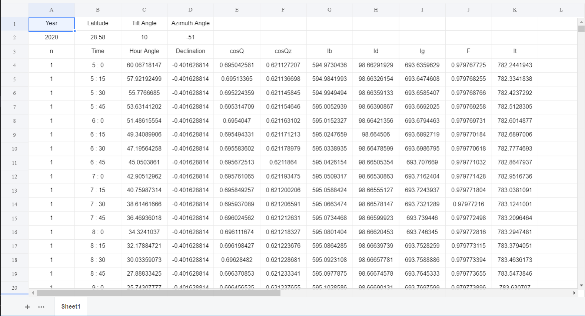

# Klucher Model Simulator

This is a simulation package for klucher model built on Python to calculate solar radiations on a tilted surface at a particular place for a whole year.

Link: https://pypi.org/project/KlucherModelSDas/1.0.1/

# Installation

Run the following  to install :

```python
pip install XlsxWriter
pip install KlucherModelSDas==1.0.1
```

## Usage

```python
from KlucherModelSDas import klucher
```

#### Generate Data for Any Year:

klucher(*year*, *latitude_of_the_place*, *tilt_angle*, *azimuth_angle*, *interval_of_time_in_minutes*)`

## Customizing Klucher Model

To install Klucher Model Simulator, along with the tools you need to develop and run tests, run the following in your virtualenv:

```bash
$pip install -e .[dev]
```

## Example

### Generating Data for 2020, Latitude: 25.58, Tilt Angle: 10 deg, Azimuth Angle: -51 deg and Interval of 15 minutes

```
from KlucherModelSDas import klucher

klucher(2020, 28.58, 10, -51, 15)
```

This creates an excel sheet named 'data.xlsx':



### Notations

```
n :day of the year
hra :hour angle
dec :declination angle
tilt :tilt angle
azi :azimuth angle
cosQ :angle of incidence of solar radiation
cosQz :zenith angle
F :correction coefficient
  
Ig :Hourly Global Radiation
Ib :Hourly Beam Radiation
Id :Hourly Diffused Radiation
It :Solar Radiation on Tilted Surface
```
